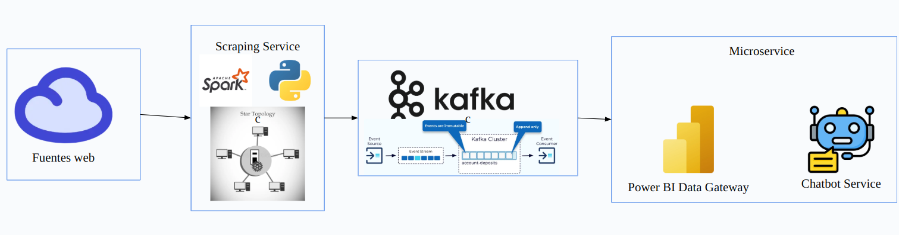

# Arquitectura de Sistema de Scraping de Productos en Tiempo Real

## Propuesta de Arquitectura

### Componentes Principales
1. **Scraper Service (PySpark/Scala)**
   - Implementación en PySpark para procesamiento distribuido
   - Implementación alternativa en Scala para máximo rendimiento
   - Capacidad de escalar horizontalmente
   - Tiempo de scraping: 5-10 segundos por producto

2. **Apache Kafka como Sistema de Mensajería**
   - Topics separados para:
     * Raw Scraping Data
     * Processed Product Information
     * Dashboard Updates
     * Chatbot Queries

3. **Microservicios Desacoplados**
   - Microservicio de Scraping
   - Microservicio de Procesamiento de Datos
   - Microservicio de Chatbot
   - Power BI Data Gateway

### Diagrama de Arquitectura



```
[Web Sources]
    ↓
[Scraper Service - PySpark/Scala]
    ↓
[Apache Kafka]
    ├── Raw Scraping Data Topic
    ├── Processed Product Topic
    ├── Dashboard Update Topic
    └── Chatbot Query Topic
    ↓
[Microservicios]
    ├── Procesamiento de Datos
    ├── Chatbot 
    └── Power BI Data Gateway
```

## Estrategia de Asincronía y Procesamiento

### Flujo de Datos
1. **Scraping Inicial**
   - PySpark/Scala ejecuta scraping en paralelo
   - Reduce tiempo de recolección
   - Manejo de múltiples fuentes simultáneamente

2. **Procesamiento de Datos**
   - Apache Kafka como buffer de mensajes
   - Desacoplamiento de servicios
   - Garantía de entrega de mensajes
   - Tolerancia a fallos

3. **Consumo de Información**
   - Chatbot consume topic en tiempo real
   - Dashboard actualiza periódicamente
   - Microservicios independientes

### Consideraciones de Implementación

#### Tecnologías
- **Scraping**: PySpark o Scala
- **Mensajería**: Apache Kafka
- **Microservicios**: Docker/Kubernetes
- **Despliegue Inicial**: On-Premises
- **Escalamiento**: Migración futura a Nube (AWS/GCP)

#### Ventajas
- Alta escalabilidad
- Procesamiento distribuido
- Tiempo de respuesta optimizado
- Flexibilidad de infraestructura

#### Retos
- Complejidad de implementación
- Requiere conocimiento especializado
- Inversión inicial en infraestructura

## Justificación Técnica

### Por qué PySpark/Scala
- **PySpark**:
  * Procesamiento distribuido
  * Integración con ecosistema Python
  * Flexibilidad de desarrollo

- **Scala**:
  * Rendimiento superior
  * Tipado estático
  * Mejor performance en big data

### Por qué Apache Kafka
- Manejo de flujos de datos en tiempo real
- Tolerancia a fallos
- Escalabilidad horizontal
- Desacoplamiento de servicios

### Estrategia de Implementación
1. Prototipo On-Premises
2. Pruebas de concepto
3. Optimización de microservicios
4. Migración gradual a nube

## Integración Específica con Power BI

### Configuración de Power BI
- **Power BI Data Gateway**
  * Conexión segura entre datos on-premises y Power BI
  * Refresco de datos en tiempo real
  * Soporte para múltiples fuentes de datos

- **Estrategia de Visualización**
  * Dashboards dinámicos
  * Informes interactivos
  * Análisis de productos en tiempo real

### Consideraciones de Power BI
- Licenciamiento (Power BI Pro/Premium)
- Configuración de Data Gateway local
- Seguridad de datos empresariales
- Rendimiento de consultas

## Consideraciones Adicionales

### Seguridad
- Implementar autenticación en microservicios
- Encriptación de datos en tránsito
- Control de acceso por servicio
- Integración con Azure Active Directory para Power BI

### Monitoreo
- Métricas de rendimiento
- Logs distribuidos
- Alertas de fallos
- Monitoreo de refresco de datos en Power BI

### Costos
- Inversión inicial moderada
- Escalabilidad bajo demanda
- Optimización de recursos computacionales
- Licenciamiento de Power BI

## Conclusión
Arquitectura robusta, escalable y flexible que permite procesamiento en tiempo real con múltiples capas de desacoplamiento, integración nativa con Power BI y alta disponibilidad.
